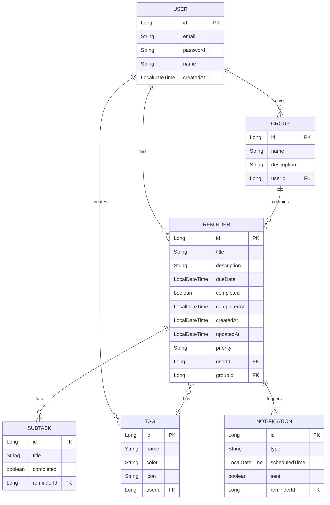

# Apple Reminders App Clone 개발 계획

## 개발 개요
Apple Reminders App의 핵심 기능을 웹 환경으로 구현하는 프로젝트입니다. Nexacro 프레임워크를 사용하여 Apple 스타일의 깔끔하고 직관적인 UI를 구현합니다. 단순한 MVP부터 시작하여 점진적으로 기능을 추가해 나갑니다.

## 기술 스택

### 프론트엔드
- **Nexacro**: UI 프레임워크 (Apple 스타일 컴포넌트)
- **TypeScript**: 정적 타입 지원
- **Tailwind CSS**: 커스텀 스타일링 (Apple 디자인 시스템)
- **React (필요 시)**: 복잡한 상태 관리
- **Framer Motion**: 애니메이션 효과

### 백엔드
- **Java 17**: 주 언어
- **Spring Boot 3.x**: 백엔드 프레임워크
- **Spring Security**: 인증 및 보안
- **Spring Data JPA**: ORM
- **MySQL 8.0**: 운영용 DB
- **H2 Database**: 개발용 DB
- **JWT**: 인증 토큰 관리
- **Redis**: 캐싱 및 세션 관리

### 개발 도구
- **Gradle**: 빌드 도구
- **Git**: 버전 관리
- **Docker**: 컨테이너화
- **Jest/React Testing Library**: 프론트엔드 테스트
- **JUnit 5**: 백엔드 테스트

## 아키텍처 설계

### 전체 아키텍처
```
┌─────────────────────────────────────────────────────────────┐
│                    Frontend (Nexacro)                       │
│  ┌─────────────┐  ┌─────────────┐  ┌─────────────┐       │
│  │   Public    │  │   Private   │  │  Admin      │       │
│  │   Resources  │  │   Pages     │  │  Dashboard  │       │
│  └─────────────┘  └─────────────┘  └─────────────┘       │
└──────────────────────┬───────────────────────────────────────┘
                       │ HTTP/HTTPS (REST API)
                       ▼
┌─────────────────────────────────────────────────────────────┐
│                  API Gateway (Nginx)                         │
│  - Rate Limiting                                            │
│  - SSL Termination                                          │
│  - Load Balancing                                           │
└──────────────────────┬─────────────────────────────────────────┘
                       │
                       ▼
┌─────────────────────────────────────────────────────────────┐
│                   Spring Boot App                            │
│  ┌─────────────────────────────────────────────────────────┐ │
│  │  Controllers  │  Services  │  Repositories  │ Config  │ │
│  └─────────────────────────────────────────────────────────┘ │
│  ┌─────────────────────────────────────────────────────────┐ │
│  │    Security Filter   │   Exception Handler             │ │
│  └─────────────────────────────────────────────────────────┘ │
└──────────────────────┬─────────────────────────────────────────┘
                       │
                       ▼
┌─────────────────────────────────────────────────────────────┐
│                  Database Layer                              │
│  ┌─────────────┐  ┌─────────────┐  ┌─────────────┐       │
│  │   MySQL     │  │   Redis    │  │   File     │       │
│  │   (RDBMS)   │  │   (Cache)  │  │   Storage  │       │
│  └─────────────┘  └─────────────┘  └─────────────┘       │
└─────────────────────────────────────────────────────────────┘
```

### 데이터 모델 설계


## 단계별 개발 계획

### Phase 1: MVP (최소 기능 제품) - 4주
**목표**: 핵심 기능만 구현하여 빠른 출시

#### 1.1 프로젝트 초기 설정 (주 1)
- Nexacro 개발 환경 구성
- Spring Boot 프로젝트 생성
- 데이터베이스 스키마 설계 (H2)
- 기본 빌드 설정 (Gradle)

#### 1.2 기본 인증 시스템 (주 2-3)
- 회원가입/로그인 API 구현
- JWT 토큰 생성 및 검증
- 간단한 세션 관리
- Nexacro 로그인/회원가입 UI 구현

#### 1.3 핵심 리마인더 기능 (주 4)
- 리마인더 CRUD API 구현
- 목록 조회 UI (Nexacro Grid)
- 간단한 상세 보기
- 완료/미완료 토글 기능

**기술적 구현**:
```java
// 핵심 API 예시
@RestController
@RequestMapping("/api/reminders")
public class ReminderController {

    @PostMapping
    public ResponseEntity<Reminder> create(@RequestBody ReminderCreateDTO dto) {
        // 리마인더 생성 로직
    }

    @GetMapping
    public ResponseEntity<List<Reminder>> list() {
        // 목록 조회 로직
    }

    @PutMapping("/{id}")
    public ResponseEntity<Reminder> update(@PathVariable Long id, @RequestBody ReminderUpdateDTO dto) {
        // 수정 로직
    }
}
```

### Phase 2: 확장 기능 - 6주
**목표**: 완성도 높은 기본 기능 구현

#### 2.1 상세 기능 구현 (주 5-6)
- 리마인더 상세 보기 모달
- 날짜 및 시간 선택기
- 우선순위 설정 (낮음, 보통, 높음)
- 간단한 검색 필터

#### 2.2 상태 관리 강화 (주 7)
- 리스트 상태 필터 (전체, 완료, 미완료)
- 정렬 기능 (생성일, 마감일)
- 선택된 항목 일괄 처리

#### 2.3 디자인 개선 (주 8-9)
- Apple 스타일 컴포넌트 구현
- 반응형 디자인 (모바일 태블릿 지원)
- 애니메이션 효과 추가
- 커스텀 스타일 시스템 구축

**Nexacro 컴포넌트 예시**:
```javascript
// Nexacro Grid 설정
var objGrid = new nexacro.Grid("reminderGrid");
objGrid.setBindDataset("dsReminders");
objGrid.setFormatCell("priority", "rowpriorityformat");

// 커스텀 셀렌더
var objDate = new nexacro.DatePicker("dueDatePicker");
objDate.setFormat("yyyy-MM-dd");
objDate.setEnable("true");
```

### Phase 3: 고급 기능 - 8주
**목표**: 사용자 경험을 극대화하는 고급 기능

#### 3.1 검색 및 필터링 (주 10-11)
- 전체 텍스트 검색
- 태그 기반 검색
- 날짜 범위 필터링
- 저장된 필터링 기능

#### 3.2 그룹 및 태그 시스템 (주 12-13)
- 그룹 생성/관리 UI
- 태그 시스템 구현
- 색상 및 아이콘 설정
- 그룹별/태그별 필터링

#### 3.3 알림 시스템 (주 14-15)
- 푸시 알림 API
- 이메일 알림 서비스
- 알림 설정 관리
- 알림 히스토리

**기술적 고려사항**:
```java
// 알림 서비스 예시
@Service
public class NotificationService {

    @Scheduled(cron = "0 */5 * * * *") // 5분마다 실행
    public void checkDueReminders() {
        // 마감 임박 리마인더 확인
        // 푸시 알림 전송
    }

    @Async
    public void sendEmailNotification(User user, Reminder reminder) {
        // 이메일 알림 발송
    }
}
```

### Phase 4: 고도화 - 6주
**목표**: 성능 및 안정성 향상

#### 4.1 데이터 관리 (주 16-17)
- 내보내기/가져오기 기능 (CSV/JSON)
- 데이터 백업 시스템
- 데이터 마이그레이션 툴
- 데이터 유효성 검증

#### 4.2 템플릿 시스템 (주 18-19)
- 리마인더 템플릿 생성
- 템플릿 라이브러리
- 템플릿 적용 기능
- 공유 템플릿 시스템

#### 4.3 성능 최적화 (주 20-21)
- 데이터베이스 인덱싱
- 캐싱 전략 (Redis)
- API 응답 최적화
- 프론트엔드 성능 개선

#### 4.4 통계 기능 (주 22)
- 완료율 통계
- 카테고리별 분석
- 시간대별 패턴
- 시각화 차트

### Phase 5: 운영 준비 - 4주
**목표**: 서비스 출시 준비

#### 5.1 테스트 (주 23-24)
- 단위 테스트 강화
- 통합 테스트 작성
- 부하 테스트
- 보안 테스트

#### 5.2 모니터링 (주 25)
- 서버 모니터링 설정
- 로그 수집 시스템
- 사용자 행동 분석
- 성능 지표 추적

#### 5.3 배포 자동화 (주 26)
- CI/CD 파이프라인 구축
- 자동 배포 설정
- 롤백 전략
- 배포 가이드 작성

## 개발 일정

| 단계 | 기간 | 주요 작업 | 산출물 |
|------|------|----------|--------|
| Phase 1 | 4주 | MVP 개발 | 기본 기능 동작 시스템 |
| Phase 2 | 6주 | 확장 기능 | 완전한 CRUD 기능 반응형 UI |
| Phase 3 | 8주 | 고급 기능 | 검색 필터링 알림 시스템 |
| Phase 4 | 6주 | 고도화 | 데이터 관리 성능 최적화 |
| Phase 5 | 4주 | 운영 준비 | 테스트 시스템 배포 자동화 |

## 보안 고려사항

### 1. 데이터 보호
- 모든 통신은 HTTPS로 암호화
- 비밀번호는 bcrypt로 해싱
- JWT 토큰은 refresh token 포함
- 민감 데이터는 DB 암호화

### 2. 입력값 검증
- SQL 인젝션 방지
- XSS 방지 필터링
- 입력값 길이 제한
- 유효성 검증 로직

```java
// 보안 설정 예시
@Configuration
@EnableWebSecurity
public class SecurityConfig {

    @Bean
    public SecurityFilterChain filterChain(HttpSecurity http) throws Exception {
        http
            .csrf(csrf -> csrf.disable())
            .sessionManagement(session -> session.sessionCreationPolicy(SessionCreationPolicy.STATELESS))
            .addFilterBefore(jwtAuthFilter(), UsernamePasswordAuthenticationFilter.class);
        return http.build();
    }
}
```

## 성능 최적화 전략

### 1. 데이터베이스
- 인덱싱 전략 (자주 조회되는 필드)
- 쿼리 튜닝 (JOIN 최소화)
- 컬럼 분할 (글로벌 텍스트 분리)

### 2. 캐싱
- Redis를 사용한 세션 저장
- API 응답 캐싱
- Nexacro Dataset 캐싱

### 3. 프론트엔드
- 컴포넌트 지연 로딩
- 가상 스크롤링 (대량 데이터)
- 이미지 옵티마이제이션

## 테스트 전략

### 1. 단위 테스트
- JUnit 5로 Service/Repository 테스트
- Mock 객체를 사용한 격리 테스트
- 커버리지 80% 이상 목표

### 2. 통합 테스트
- API 엔드포인트 테스트
- Nexacro 컴포넌트 테스트
- 데이터베이스 트랜잭션 테스트

### 3. E2E 테스트
- 사용자 시나리오 테스트
- 브라우저 자동화 테스트
- 성능 테스트

## 프로젝트 관리

### 1. 개발 팀 구성
- 1명: 프로젝트 매니저
- 2명: 백엔드 개발
- 1명: 프론트엔드 개발
- 1명: QA

### 2. 커뮤니케이션
- 일일 스탠드업 미팅
- 주간 회의 및 회고
- Jira를 이용한 이슈 추적
- Slack을 이용한 협업

### 3. 문서화
- API 문서 (Swagger)
- 개발 문서 (Confluence)
- 사용자 매뉴얼
- 배포 문서

## 리스크 관리

### 1. 기술적 리스크
- **리스크**: Nexacro 학습 곡선
  - **대응**: 초기에 POC 진행, 문서 정비
- **리스크**: 데이터베이스 성능
  - **대응**: 모니터링 시스템 구축, 정기 튜닝

### 2. 일정 리스크
- **리스크**: 개발 지연
  - **대응**: 이슈 관리, 마일스톤 설정
- **리스크**: 기능 변경
  - **대응**: 버전 관리, 롤백 전략

### 3. 품질 리스크
- **리스크**: 버그 발생
  - **대응**: 테스트 자동화, QA 프로세스
- **리스크**: 사용자 피드백
  - **대응**: 피드백 수집 시스템

---

**작성일자**: 2026-03-20
**최종 수정**: -
**버전**: 1.0
**작성자**: 개발팀